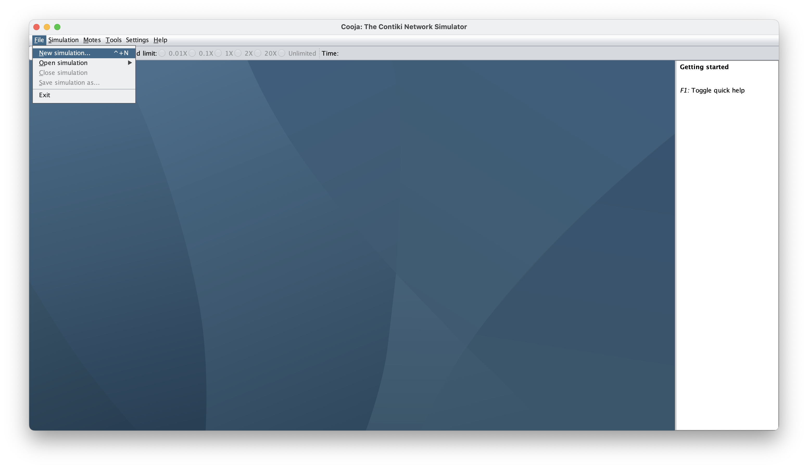
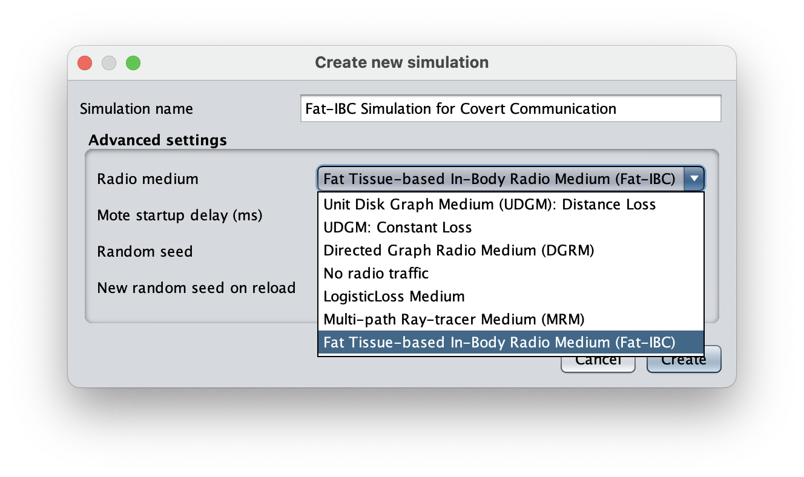
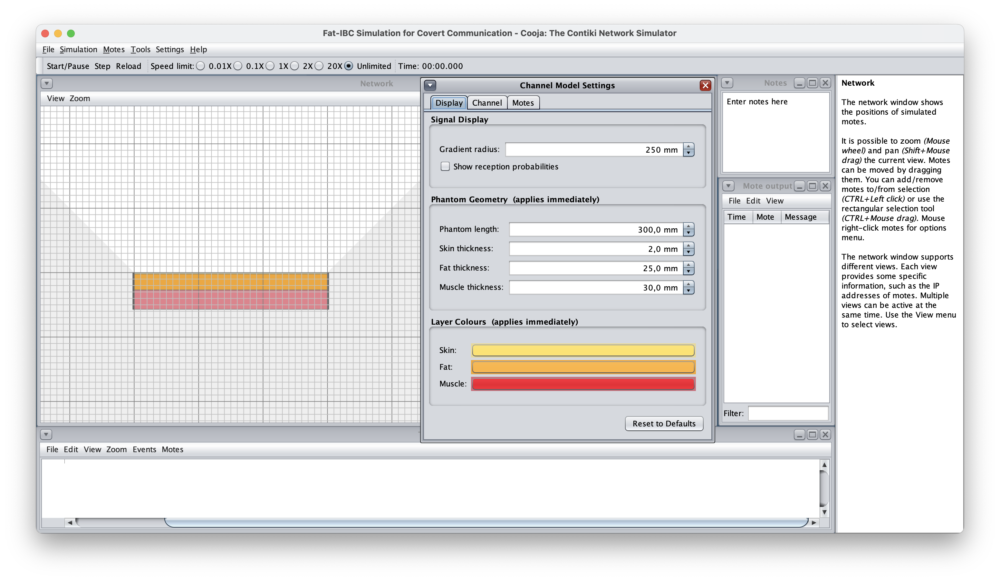
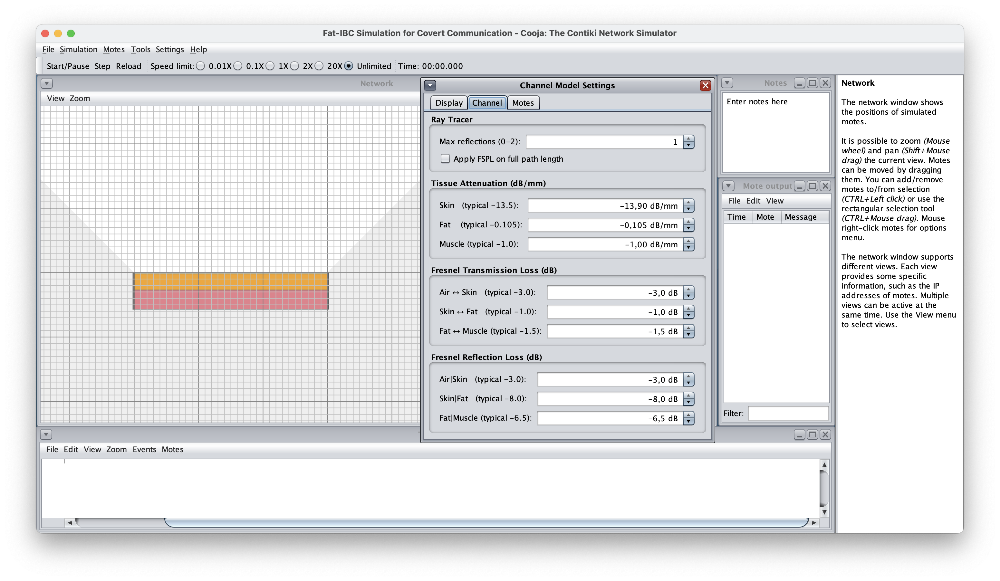
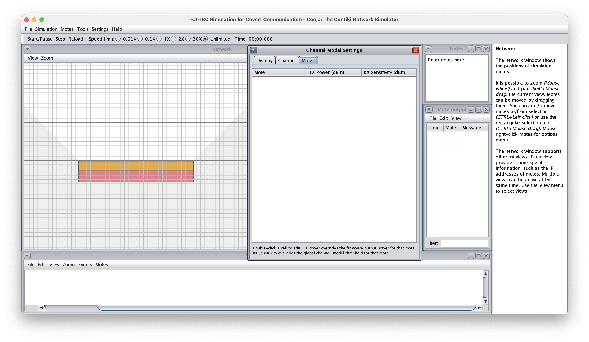

# FatSim: Fat Tissue-based In-Body Radio Medium for Cooja

FatSim is a radio medium plugin for the Cooja network simulator. It models
fat tissue-based in-body communication (Fat-IBC) at 2.45 GHz, in which implanted
nodes use the subcutaneous fat layer as a low-loss channel between them.

FatSim replaces Cooja's homogeneous propagation models with a layered
skin–fat–muscle phantom. For every transmitter–receiver pair, a 2D ray tracer
computes the received power from the direct path, from specular reflections at the
tissue boundaries and from diffraction at the phantom corners. Cooja then uses that
power to decide whether a packet is received, interfered or captured, so unmodified
Contiki-NG firmware runs on top of a tissue-aware channel.

The tissue and interface coefficients are calibrated against CST Microwave Studio
field-probe data of a 2 mm skin, 25 mm fat and 30 mm muscle phantom. With these
coefficients, the simulated path loss matches CST with an RMSE of about 2.2 dB
between 2 and 28 cm.



## Contents

- [Source files](#source-files)
- [Building](#building)
- [Creating a simulation](#creating-a-simulation)
- [Channel Model Settings](#channel-model-settings)
- [Placing motes](#placing-motes)
- [How the channel model works](#how-the-channel-model-works)
- [Parameter reference](#parameter-reference)
- [Simulation file (.csc) configuration](#simulation-file-csc-configuration)
- [Headless runs and scripting](#headless-runs-and-scripting)
- [Scope and limitations](#scope-and-limitations)

## Source files

| File | What it does |
|---|---|
| `InBody.java` | Implements the radio medium that Cooja lists as *Fat Tissue-based In-Body Radio Medium (Fat-IBC)*. It creates radio connections, applies interference and the capture effect, stores per-mote Tx power and Rx sensitivity overrides, and saves them to the `.csc` file. |
| `InBodyChannelModel.java` | Holds every configurable parameter with its default value, loads and saves non-default parameters in the `.csc` file, and exposes the received-power and reception-probability calculations. |
| `PropagationModel.java` | Runs the ray tracer. It collects the direct, reflected and diffracted paths for a node pair, computes the gain of each path, and combines the paths into one received power. |
| `PhantomGeometry.java` | Builds the skin, fat and muscle rectangles and the restricted region, and classifies any point by its tissue type. |
| `TissueType.java` | Defines the tissue classes: air, skin, fat, muscle and restricted. |
| `GeometryHelpers.java` | Provides line–rectangle intersection, mirroring and other 2D geometry used by the ray tracer. |
| `PhantomVisualizerSkin.java` | Adds the *Phantom Setup* skin to the Network visualizer. It draws the colour-coded tissue layers and the restricted region. |
| `InBodyVisualizerSkin.java` | Adds the *In-body signals* skin to the Network visualizer. It draws signal gradients and reception-probability lines for the selected motes and opens the *Channel Model Settings* dialog. |
| `SignalGradientPainter.java` | Paints the radial signal-strength gradient around a selected mote, clipped to fat and air. |
| `ProbabilityLinePainter.java` | Draws a line from each selected mote to every other mote, coloured from red (low) to green (high) reception probability and labelled with the probability and the received power. |
| `RxSensitivityConf.java` | Provides the *RX Sensitivity* plugin, a table for setting a per-mote receiver sensitivity. |

## Building

FatSim is part of this Cooja tree, and `ExtensionManager` registers it as a built-in
radio medium, so you do not need to install it separately. Build Cooja as usual:

```
cd tools/cooja
./gradlew run          # start the Cooja GUI
./gradlew fullJar      # build build/libs/cooja-full.jar for headless runs
```

Cooja requires Java 21. When you start the jar directly, pass `--enable-preview`:

```
java --enable-preview -jar build/libs/cooja-full.jar --contiki=<contiki-ng root>
```

## Creating a simulation

1. Start Cooja and choose **File → New simulation…**.
2. In **Radio medium**, select **Fat Tissue-based In-Body Radio Medium (Fat-IBC)**.
3. Set the simulation name and, if needed, the random seed, and click **Create**.



When you create the simulation, FatSim loads its default parameters, and the Network
window shows the phantom. The skin is drawn in yellow, the fat in orange and the
muscle in red. The light grey wedges beside and below the phantom mark the
restricted region.

## Channel Model Settings

To open the settings dialog, right-click the Network canvas and choose
**Channel model settings …**. The *In-body signals* skin must be active in the
visualizer's **View** menu. The dialog has three tabs, and changes apply immediately.

### Display

The **Display** tab controls the visualization and the phantom geometry.

- **Gradient radius** sets the radius in millimetres of the signal-strength gradient
  drawn around each selected mote.
- **Show reception probabilities** draws a probability line from each selected mote to
  every other mote. Each line shows the reception probability and the received power
  in dBm.
- **Phantom Geometry** sets the phantom length and the skin, fat and muscle thicknesses
  in millimetres.
- **Layer Colours** changes the colours used to draw each tissue layer.
- **Reset to Defaults** restores the default phantom geometry and layer colours. It does not change the channel parameters.



### Channel

The **Channel** tab sets the propagation parameters.

- **Max reflections** sets the highest reflection order the ray tracer uses (0, 1 or 2).
- **Apply FSPL on full path length** applies free-space path loss to the whole path
  instead of only to the part of the path that runs through air (see
  [Free-space path loss](#free-space-path-loss)).
- **Tissue Attenuation** sets the effective attenuation of skin, fat and muscle in dB/mm.
- **Fresnel Transmission Loss** sets the loss each time a ray crosses an interface.
- **Fresnel Reflection Loss** sets the loss each time a ray reflects off an interface.



The values in brackets in the labels, such as *typical −13.5* for skin, are reference
values from measurements or theory. The default for skin is −13.9 dB/mm.

### Motes

The **Motes** tab lists every mote with its Tx power and Rx sensitivity. To override
either value for one mote, double-click its cell. A Tx power override replaces the
output power that the firmware sets, and an Rx sensitivity override replaces the
global receiver sensitivity. FatSim saves both overrides in the `.csc` file.



The separate **RX Sensitivity** plugin (in the **Tools** menu) offers the same
per-mote sensitivity table in its own window.

## Placing motes

Cooja coordinates are in millimetres, and the y axis grows downwards. With the default
origin (0, 0) at the top-left corner of the skin, the layers lie at these depths:

| Layer | y range (mm) |
|---|---|
| Air above the body | y < 0 |
| Skin | 0 to 2 |
| Fat | 2 to 27 |
| Muscle | 27 to 57 |
| Restricted (below the muscle) | y > 57 |

Place implants that communicate through fat inside the fat band, for example at
y = 14.5 mm for mid-depth. Place external devices, such as an eavesdropper or an
on-body gateway, in the air above the skin.

FatSim marks the space below the muscle as restricted, and also the space beside the
phantom below a 45° line that rises from each top corner. FatSim excludes motes placed
in the restricted region from all radio connections and discards any ray that would
cross it.

## How the channel model works

### Paths

For each transmitter–receiver pair, `PropagationModel` collects these paths:

1. **Direct path.** This is the straight line from the transmitter to the receiver.
2. **First-order reflections.** Each of these bounces once off the air|skin, skin|fat or
   fat|muscle interface. The ray tracer finds them with the image method: it mirrors
   the source across the interface, intersects the line from the image to the receiver
   with the interface, and rejects the path if the bounce point misses the interface
   or the two nodes lie on opposite sides of it.
3. **Second-order reflections** (when Max reflections is 2). These bounce off every
   ordered pair of the three interfaces, found with a double image.
4. **Single-edge diffraction** (when `rt_max_diffractions` is 1). These paths bend
   around the two top corners of the phantom and lose a fixed amount of power per edge.

FatSim uses neither the muscle bottom nor the phantom side walls as reflectors or
diffraction edges, because they border the restricted region.

### Path gain

The gain of one path in dB is the sum of four terms:

- the attenuation of each tissue multiplied by the length of the path inside that tissue,
- the Fresnel transmission loss of each interface the path crosses,
- the Fresnel reflection loss of each bounce, and
- the free-space path loss of the part of the path that runs through air.

FatSim decides the tissue of each path segment from the tissue at the segment's midpoint.

### Free-space path loss

By default, FatSim applies free-space path loss only to the length of the path that
runs through air. The calibrated tissue coefficients already contain the geometric
spreading inside tissue, so applying free-space loss to the whole path would count that
spreading twice. **Apply FSPL on full path length** switches to the whole path, which
gives a more conservative estimate.

### Combining paths

FatSim converts each path gain to linear power, keeps the paths within 30 dB of the
strongest one, and sums their powers incoherently. It then caps the combined gain at
0 dB, because tissue is a passive medium. FatSim uses incoherent summation because the
geometric path length inside tissue does not predict the electrical phase reliably,
and coherent summation would create deep nulls that phantom measurements do not show.

### Reception, interference and capture

The received power is the transmit power plus the system gain plus the combined path
gain. FatSim compares the received power with the receiver sensitivity and evaluates
the reception probability as a Gaussian CDF whose spread comes from the system gain
variance. Cooja then draws each reception from this probability with the simulation's
seeded random generator, so runs with the same seed are reproducible.

Any signal above the background noise that overlaps an ongoing reception counts as
interference. If you enable the capture effect, a receiver switches to a new packet when
that packet is at least 3 dB stronger and arrives within the 128 µs preamble window,
as IEEE 802.15.4 transceivers do. If two radios use different channels, FatSim treats
the transmission as interference, not as a reception.

## Parameter reference

The table lists the defaults in `InBodyChannelModel.java`. The *XML name* column gives
the element name to use in a `.csc` file.

| Group | XML name | Meaning | Default |
|---|---|---|---|
| Radio | `tx_power` | Default Tx output power (dBm) | −30 |
| Radio | `rx_sensitivity` | Receiver sensitivity (dBm) | −100 |
| Radio | `snr_threshold` | SNR reception threshold (dB) | 6 |
| Radio | `bg_noise_mean` / `bg_noise_var` | Background noise mean (dBm) and variance (dB) | −100 / 1 |
| Radio | `system_gain_mean` / `system_gain_var` | Extra system gain mean and variance (dB) | 0 / 4 |
| Radio | `frequency` | Frequency (MHz) | 2450 |
| Radio | `apply_random` | Debug option that adds a random system gain to every computation | false |
| Ray tracer | `rt_max_reflections` | Highest reflection order (0–2) | 1 |
| Ray tracer | `rt_max_diffractions` | Highest diffraction order (0–1) | 0 |
| Ray tracer | `rt_refrac_air_skin` / `rt_refrac_skin_fat` / `rt_refrac_fat_muscle` | Fresnel transmission loss per interface (dB) | −3.0 / −1.0 / −1.5 |
| Ray tracer | `rt_reflec_air_skin` / `rt_reflec_skin_fat` / `rt_reflec_fat_muscle` | Fresnel reflection loss per surface (dB) | −3.0 / −8.0 / −6.5 |
| Ray tracer | `rt_diffr_coefficient` | Diffraction loss per edge (dB) | −10 |
| Ray tracer | `rt_fspl_on_total_length` | Apply free-space path loss to the whole path | false |
| Tissue | `skin_attenuation` / `fat_attenuation` / `muscle_attenuation` | Effective attenuation (dB/mm) | −13.9 / −0.105 / −1.0 |
| Tissue | `restricted_attenuation` | Attenuation in the restricted region (dB/mm) | −100 |
| Geometry | `phantom_origin_x` / `phantom_origin_y` | Top-left corner of the skin (mm) | 0 / 0 |
| Geometry | `phantom_length` | Phantom length (mm) | 300 |
| Geometry | `skin_thickness` / `fat_thickness` / `muscle_thickness` | Layer thickness (mm) | 2 / 25 / 30 |
| Capture | `captureEffect` | Enable the capture effect | true |
| Capture | `captureEffectSignalThreshold` | Power advantage needed to capture (dB) | 3 |
| Capture | `captureEffectPreambleDuration` | Window in which a stronger packet can capture (µs) | 128 |

The GUI exposes the most common parameters. Set the others, such as
`rt_max_diffractions`, in the `.csc` file.

The theoretical normal-incidence Fresnel values for the IT'IS dielectric data are
−3.18, −1.02 and −1.36 dB for transmission and −2.84, −6.80 and −5.69 dB for
reflection. The defaults are the values calibrated against CST.

## Simulation file (.csc) configuration

FatSim stores only the parameters that differ from their defaults, inside the
`<radiomedium>` element. Each parameter is an element with a `value` attribute.
Per-mote overrides use `TxPowerConfig` and `RxSensitivityConfig` elements with the
mote ID as an attribute:

```xml
<radiomedium>
  org.contikios.inbody.InBody
  <rt_max_reflections value="2" />
  <rt_max_diffractions value="1" />
  <fat_thickness value="20.0" />
  <TxPowerConfig Mote="1">0.0</TxPowerConfig>
  <TxPowerConfig Mote="2">-10.0</TxPowerConfig>
  <RxSensitivityConfig Mote="3">-90.0</RxSensitivityConfig>
</radiomedium>
```

Write values with the same type as the default. For example, `rt_max_reflections` is an
integer (`2`, not `2.0`), and `fat_thickness` is a decimal (`20.0`). `tx_power` has an
integer default, so set per-mote Tx power with `TxPowerConfig` instead.

## Headless runs and scripting

FatSim works with Cooja's headless mode and its JavaScript test scripts:

```
java --enable-preview -jar tools/cooja/build/libs/cooja-full.jar \
     --no-gui --contiki=<contiki-ng root> --logdir=<log dir> --random-seed=1 sim.csc
```

A script can read FatSim's reception decisions through the radio medium. For example,
this snippet counts the frames that one radio receives without interference:

```javascript
var Radio = Java.type("org.contikios.cooja.interfaces.Radio");
var rm = sim.getRadioMedium();
var target = sim.getMoteWithID(5).getInterfaces().getRadio();
var count = { rx: 0 };
rm.getRadioTransmissionTriggers().addTrigger(count, function (ev, obj) {
  if (ev != Radio.RadioEvent.TRANSMISSION_FINISHED) return;
  var d = rm.getLastConnection().getDestinations();
  for (var i = 0; i < d.length; i++) { if (d[i].equals(target)) { count.rx++; break; } }
});
```

`examples/fatsim-icc` in the Contiki-NG tree contains a complete experiment kit that uses
this approach. It includes firmware, a simulation generator and a results parser.

For reproducible runs, keep `apply_random` off. That option draws from an unseeded
`java.util.Random`, so runs with it on differ even with the same seed. With it off,
reception is still random per packet, but the draws come from the simulation's seeded
generator.

## Scope and limitations

- FatSim is calibrated at 2.45 GHz for a planar phantom with 2 mm skin, 25 mm fat and
  30 mm muscle, for distances up to about 30 cm. Other frequencies, such as MedRadio
  (401–406 MHz), need new coefficients fitted to EM data at that frequency.
- The model is 2D and assumes smooth, parallel tissue interfaces. It does not model
  curvature, rough boundaries or anatomical variation beyond the layer thicknesses you set.
- You can change the layer thicknesses, but the coefficients were validated only for the
  default 25 mm fat layer. Expect larger errors for thin fat layers.
- Between about 4 and 20 cm, FatSim underestimates the CST path loss by up to about 3 dB.
  A likely cause is that FatSim applies normal-incidence Fresnel losses to rays that hit
  the fat boundaries at grazing angles.
- The channel gain is normalized so that it is close to 0 dB at short range, and it does
  not include the antenna losses of a real implant. Model those losses with
  `system_gain_mean` or with lower transmit powers.
- The channel is deterministic for fixed node positions. Randomness comes from the system
  gain variance in the reception probability.
